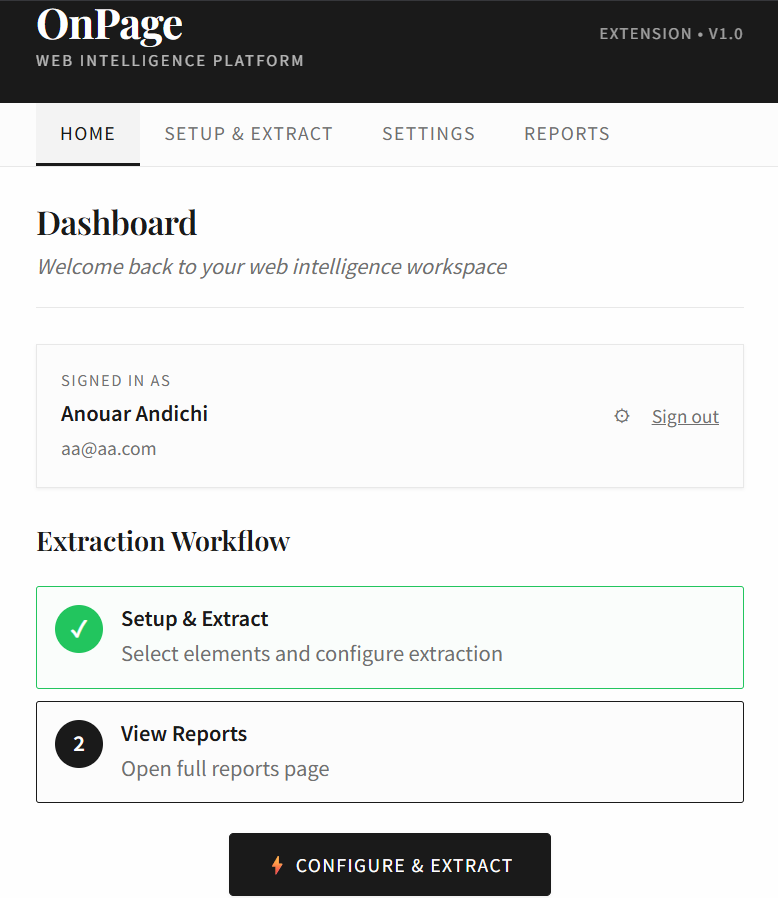
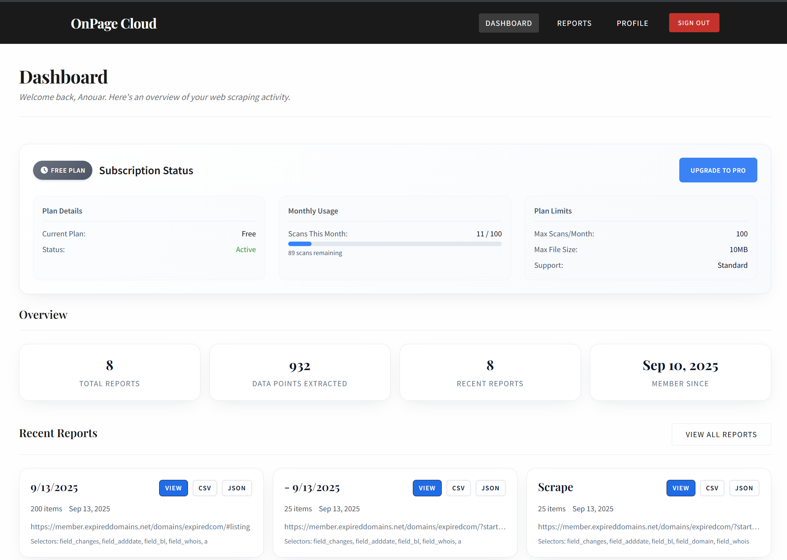
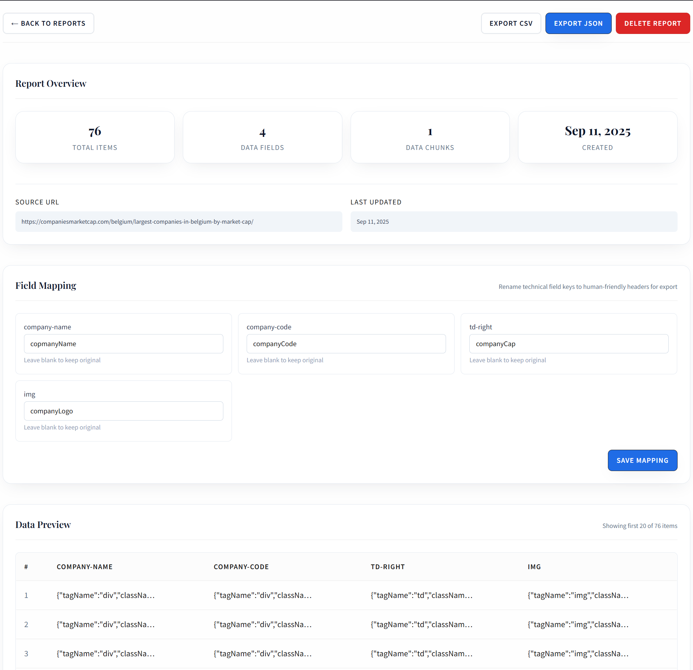

# OnPage.dev – Open Source Chrome Scraper Extension

A **Chrome extension for web scraping** with visual element selection and data export. Use the cloud version on [onpage.dev](https://onpage.dev) or run it locally with the open-source backend.  

---

## 🌟 Features

- **Visual element selection** – hover highlights make choosing elements easy  
- **Smart scraping** – auto-scroll and detect dynamic content  
- **Data export** – CSV and JSON support  
- **Flexible storage** – save data in the cloud or locally  
- **Modern Chrome extension** – Manifest V3 compatible
---

## 📸 Screenshots

### Extension Popup


### Dashboard


### Report View


---

## ⚡ Two Ways to Use OnPage.dev

### 1. Cloud Version (Recommended)
- Hosted at [onpage.dev](https://onpage.dev)  
- No setup required  
- Data is saved securely in your account  

### 2. Self-Hosted Open Source Version
- Run the backend locally to keep your data private  
- Includes the Chrome extension + Node.js backend  

---

## 🛠️ Quick Start – Self-Hosted Version

### Backend Setup
```bash
cd backend
cp .env.example .env
# Edit .env with your MongoDB URI and JWT secret
npm install
npm start
```

### Chrome Extension
1. Open `chrome://extensions/`  
2. Enable **Developer mode**  
3. Click **Load unpacked** and select the `extension` folder  

---

## 🚀 Usage

1. Open the extension popup and sign up/log in  
2. Click **Select Elements** to choose what to scrape  
3. Click **Start Scraping** to collect data  
4. View and export your data in **Reports**  

---

## ⚙️ Environment Variables

- `PORT` – Server port (default: 3000)  
- `MONGODB_URI` – MongoDB connection string  
- `JWT_SECRET` – Secret key for JWT tokens  

---

## 📜 Legal Notice

**Use responsibly!** Always respect website terms of service and robots.txt. Only scrape public data you have permission to access.  

---

## 🤝 Contributing

1. Fork the repository  
2. Create a feature branch  
3. Submit a pull request  

---

## 📝 License

MIT License

